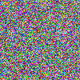
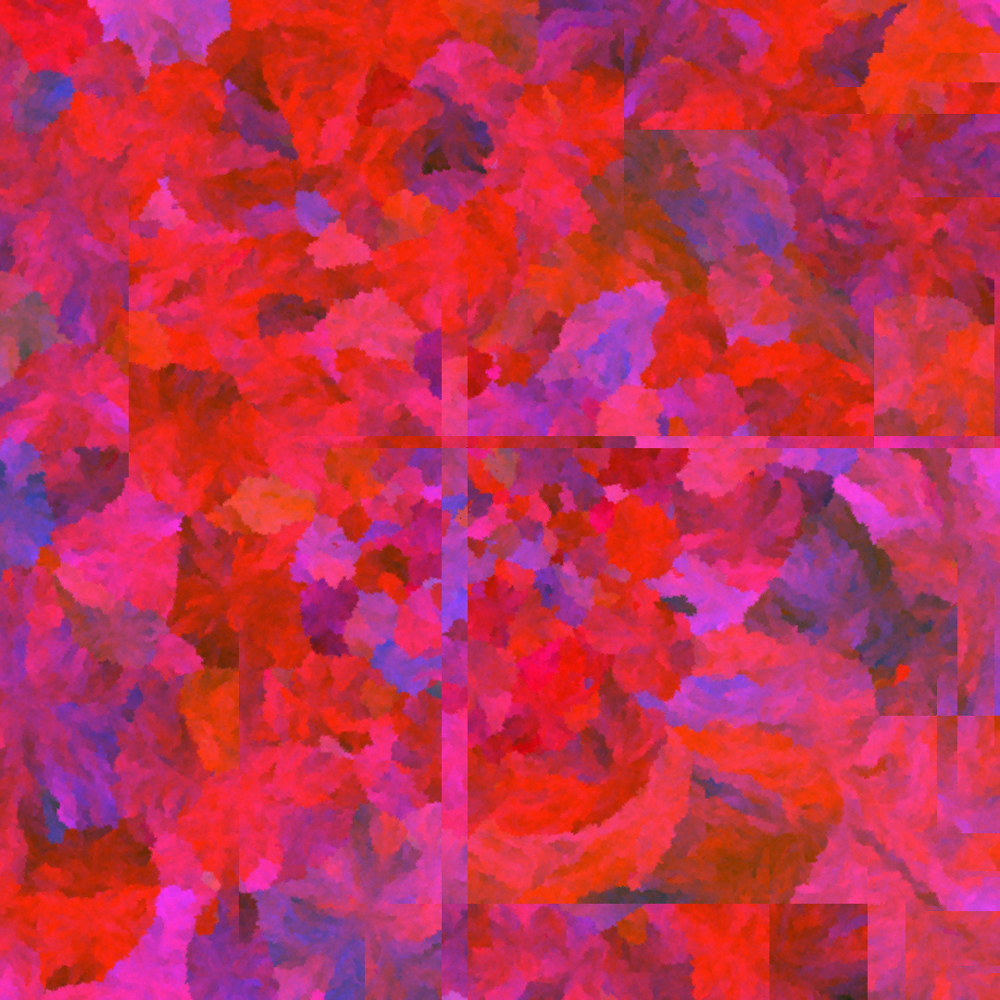
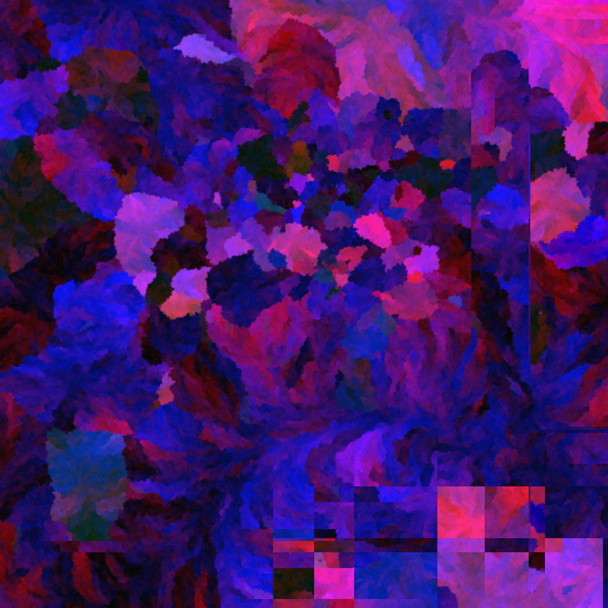
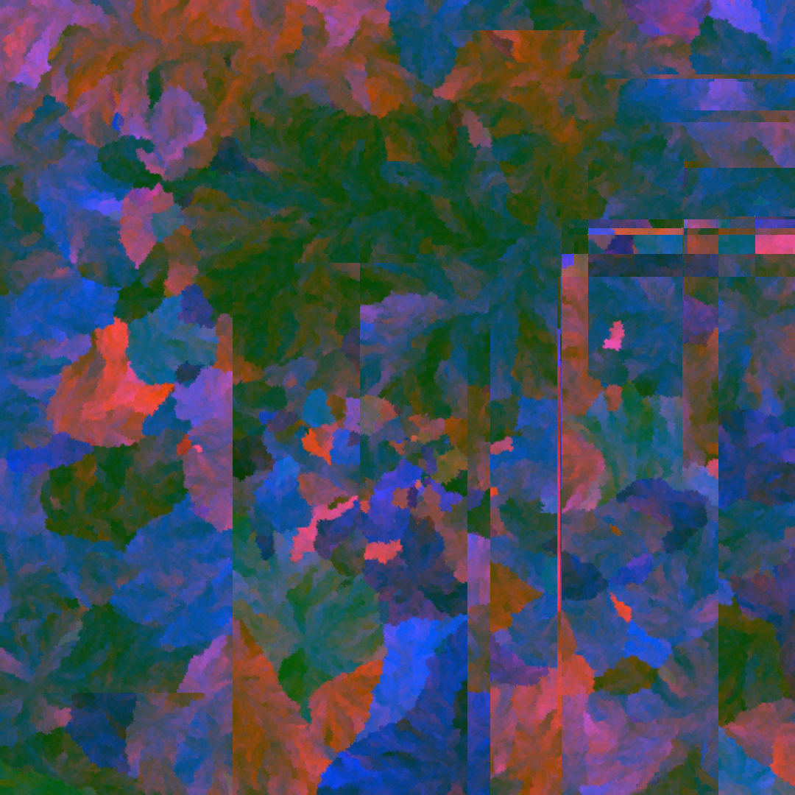

# Pixel Mining

An educational implementation of SHA-256 pixel mining, a novel generative art technique. Each pixel is found by searching, in a way inspired by [proof-of-work](https://en.wikipedia.org/wiki/Proof_of_work): you try many candidates until one is accepted. The color of that pixel comes from a [hash](https://en.wikipedia.org/wiki/Cryptographic_hash_function).

This repo teaches the core idea, then gives you one small program you can run. Many details in that program are artistic choices (what to use as a seed, which neighbors to compare, whether there is a shape, how strict the numbers are, and so on). Those choices are examples. They are not the definition of pixel mining. The technique leaves infinite room for other artists: different seeds, rules, shapes, and tastes are all still pixel mining.

## The core idea

Pixel mining needs four things:

1. **A seed.** Start from any data you can turn into a hash: a number, a sentence, an image file, weather data, a sound file, anything. The seed is only the starting point of the chain.

2. **A hash chain.** A [hash](https://en.wikipedia.org/wiki/Cryptographic_hash_function) is a fingerprint of data. [SHA-256](https://en.wikipedia.org/wiki/SHA-2) is one common hash function: put anything in, get out a fixed-length fingerprint (the digest). In pixel mining, each next pixel’s hash is made from the previous pixel’s hash plus a small number called a **nonce** (a candidate you are testing: 0, then 1, then 2, and so on). If you keep the seed and every nonce, anyone can rebuild the whole chain and check that the image is real.

3. **Color from the hash.** A hash digest is already written in the same discrete space as 8-bit RGB. [Hexadecimal](https://en.wikipedia.org/wiki/Hexadecimal) counts with 16 symbols per digit (`0`–`9` then `a`–`f`), where everyday decimal counts with 10 (`0`–`9`). Two hex digits make one byte: the smallest pair is `00` (decimal 0) and the largest is `FF` (decimal 255). That is exactly the range of one RGB channel. You are not squeezing cryptography into a foreign color model; you are reading color-sized units out of the digest. Which bytes or hex pairs you pick is up to you. What is fixed is that each channel must end up as a number from 0 to 255.

4. **A rule that rejects most candidates.** If the rule is missing, or too loose, almost every nonce passes. Then there is little real search, and the picture collapses into noise: colorful static with no structure. So you define a rule that is strict enough. Only when the hash color passes the rule do you keep that pixel and move on. The rule can be almost anything: “stay close to neighboring pixels,” “stay inside a shape,” “be bright enough,” and so on. The important part is that the rule rejects most candidates, so each pixel costs real computer work.

There is no color palette deciding the look in advance. The hash produces the color. The search for an accepted nonce is the work. The main principle of this technique is that the color of the next pixel is unknown until it is mined.

### When the rule is too loose: noise

A common early mistake is a rule that almost never says no. You still get an image file, but it looks like TV static. Here is one such early trial (100×100), kept as a warning, not as a finished piece:



Stricter rules mean more rejected nonces, more hashing, and usually more structure.

## How the hash chain works

In short:

```
seed_hash  = SHA-256(seed_material)
hash[n+1]  = SHA-256( hash[n] + str(nonce) )
```

Concrete example with seed text `hello` and nonce `42`:

```
seed_material = "hello"

seed_hash = SHA-256("hello")
          = 2cf24dba5fb0a30e26e83b2ac5b9e29e1b161e5c1fa7425e73043362938b9824

hash[1]   = SHA-256( seed_hash + "42" )
          = bab33dabce41c0d51b4bc3f97640069320ac3214836368e8e542d0ab46a46ff1
```

Each of those long strings is one SHA-256 digest: 64 hexadecimal characters (32 bytes). The next pixel would take `hash[1]`, try nonces again, and so on.

- `seed_material` is whatever you chose as the seed (text, a number as text, file bytes, …).
- `nonce` is the integer that passed the rule for that pixel.
- You must agree on an order of pixels (for example left to right, top to bottom). Any clear order is fine. Verification only needs everyone to use the same order.

## How this repo turns a hash into RGB

See point 3 above for why hex pairs and RGB channels match (both use 0–255).

A SHA-256 digest is 32 bytes long. Written in hex, that is 64 characters. This repo’s example builds each channel by adding several hex pairs from the digest, then keeping the result in range with modulo 256. “Modulo 256” means: after dividing by 256, keep only the remainder, so the answer is always between 0 and 255.

```
R = (sum of hex pairs at positions 0, 3, 6, ...) mod 256
G = (sum of hex pairs at positions 1, 4, 7, ...) mod 256
B = (sum of hex pairs at positions 2, 5, 8, ...) mod 256
```

Skipping every third character (0, then 3, then 6, …) is only this example’s way to mix the digest into three channels. You could instead take the first three bytes of the digest, or any other clear recipe. What matters for the technique is still: color comes from the hash, and each channel is a number from 0 to 255.

Good practice is to use as much of the hash’s entropy as you can wherever you state your rules, so the outcome stays tied to the digest rather than to a tiny corner of it.

## The acceptance rule in this example

Without a rule, or with a very weak one, nonce `0` (or the first few nonces) is often enough, and the image tends toward noise. With a useful rule, the program tries `0, 1, 2, …` until the color is accepted.

**In this repository**, the example rule is simple: the new pixel’s color should stay close to the pixel on its left and the pixel above it. That is easy to picture when you fill the image row by row. For each of R, G, and B:

1. Look at how far apart the left and top neighbors are on that channel.
2. Allow at least that much room (and at least a minimum “tolerance” number you choose).
3. Accept the candidate only if it sits inside that room for both neighbors.

The left/top neighbors, the exact formula, and the tolerance numbers (for example 5 or 13) are choices for this demo. Another artwork could use a different rule and still be pixel mining.

## Other choices in this demo (optional)

These make the demo concrete. They are not required by the technique:

| Choice in this repo | Why it is only an example |
|---|---|
| Default seed = current time | Handy. You can pass any `--seed` string instead. |
| Fill order: left to right, top to bottom | One clear order. Other orders are fine if verification uses the same one. |
| A circle in the middle | A composition idea. Other shapes, or no shape, are fine. |
| Tolerance 5 outside the circle, 13 inside | Taste and speed. Larger numbers mean less search, but a noisier output. |
| Background pixels ignore circle neighbors | A visual idea used here. Not required. |

Larger artworks may use more rules on top of this. This teaching repo keeps things small on purpose.

## Running a demo

```bash
pip install -e .
# or: pip install numpy Pillow

# Small run with a looser (faster) tolerance
python -m pixel_mining --width 32 --bg-tolerance 15

# Same image every time: any seed string
python -m pixel_mining --width 32 --seed "hello" --bg-tolerance 15

# Optional: use a timestamp number as the seed text
python -m pixel_mining --width 32 --timestamp 1700000000000 --bg-tolerance 15

# Also save every nonce (so the chain can be checked later)
python -m pixel_mining --width 32 --seed "hello" --bg-tolerance 15 --save-nonces
```

Results go into the `output/` folder: a PNG image, and optionally a JSON file listing every nonce.

`--bg-tolerance` and `--circle-tolerance` only change this demo’s neighbor rule. Higher numbers usually finish faster, and can also make the image noisier if you push them too far.

This code is plain Python on one CPU core. A small grid (for example 32×32) is meant for learning. It is not a production miner.

## Mining for real (C, and CPUs with SHA hardware)

Python is fine to learn the idea. It is a poor place to leave the nonce search if you care about finished pieces. Almost all of the time is spent hashing. A serious production miner should rewrite that hot loop in **C** (or another compiled language that can call the CPU’s hash instructions directly). Keep the same rules and the same chain. Only the search engine gets faster.

This repository does **not** ship a C miner. The point here is the technique. When you move from demos to production, plan on a C inner loop, and usually on using many CPU cores in parallel for the nonce search.

Hardware helps too. Many modern CPUs include instructions that accelerate SHA-256 (often called SHA extensions or SHA-NI). Your C code (or a solid crypto library) can use those so each hash costs fewer cycles than a pure software implementation.

One solid choice used in practice for this work is **AMD EPYC 7B13** (Milan). It is a many-core server CPU with SHA acceleration, which fits long mining jobs. Similar options exist elsewhere in the same family and beyond, for example:

- Other **AMD EPYC** chips from Zen 3 / Milan onward (and later EPYC generations), which also expose SHA acceleration
- **AMD Ryzen** desktop chips (Zen and later), if you mine on a workstation instead of a cloud VM
- **Intel** CPUs that support SHA-NI (for example many Ice Lake and newer client/server parts; check the specific model)

Cloud listings do not always spell out “SHA-NI” in the marketing name. Prefer instance types whose CPU generation is known to include those instructions, then verify on the machine (`lscpu` / CPU flags, or your library’s runtime feature check). Faster hashing means less wall-clock time for the same rules, which also tends to mean less electricity for the same piece.

## Example pieces

These images were mined as finished artworks (circle composition, and extra artistic rules beyond this teaching code). They show what the technique can look like when the rules are strict enough to escape noise. Running this repo will not recreate them pixel for pixel.

### Piece 1774518366175 (600×600)


Olive and ochre tones. The circle in the middle reads as its own disk.

### Piece 1773744480267 (600×600)


Teal and green tones. The circle has a different grain from the background.

## Energy and ecological impact

Pixel mining uses real electricity. Every rejected nonce is hashing work, so larger images and stricter rules cost more energy. That cost is part of the medium: the work is what makes the image’s history checkable.

If you mine on a laptop, notice the heat and the battery. If you mine in the cloud, prefer providers and regions that run on renewable or otherwise low-carbon electricity when you can. The technique does not require any particular cloud. It only requires computation.

## What this repo leaves out

- A production C miner (see above: you should plan to write one if you mine seriously)
- Cloud upload, databases, and resume/checkpoint systems used in a full studio setup
- Extra artistic filters used in some finished pieces
- Pixel-perfect copies of artworks published elsewhere

## Project structure

```
pixel_mining/
    __init__.py       Package info
    core.py           Seed, hash to RGB, chain, example rule, nonce search
    geometry.py       Example circle and neighbor helpers
    __main__.py       Command-line program
examples/
    piece_*.png                 Finished example artworks
    determined_ink_*.png        Pieces shown under Projects
    noise_loose_rules.png       Early trial with rules too loose
```


## Credits

Pixel mining was invented by Mariusz Brucki, a generative art artist and data engineer from Poland.

Contributions are welcome: clearer teaching material, other example rules, bug fixes, docs, and experiments that stay true to the core idea. If you build something with this technique, feel free to open an issue or a pull request and share it.

## Projects

- [Determined.ink](https://determined.ink) — the first public implementation of pixel mining, developed by Mariusz Brucki

<p>
  <a href="./examples/determined_ink_01.png"></a>
  <a href="./examples/determined_ink_02.png"></a>
  <a href="./examples/determined_ink_03.png"></a>
</p>

## License

MIT. See [LICENSE](LICENSE).
