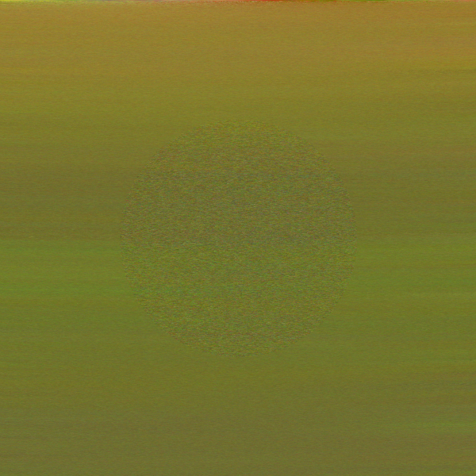
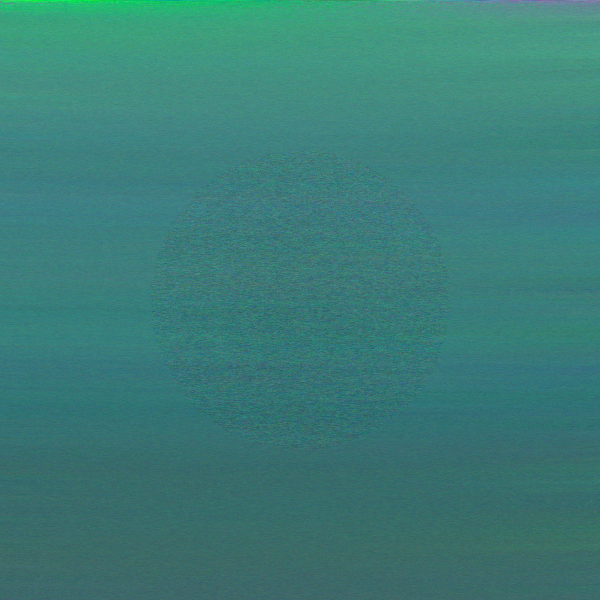

# Pixel Mining

An educational implementation of the SHA-256 pixel mining technique used by [Determined.ink](https://determined.ink), a cryptographic generative art project by Mariusz Brucki.

Every pixel in a pixel-mined image is discovered through proof-of-work. There is no palette, no random number generator, no artistic filter. The colors come directly from SHA-256 hash digests, and each pixel is linked to the previous one in a cryptographic chain. The result is an image whose provenance is mathematically verifiable.

This repository extracts and teaches the foundational algorithm. It is not the production miner (which uses multiprocessing, C extensions, and cloud infrastructure), but the core logic is identical.

## What pixel mining is

A pixel-mined image starts from a single seed: a millisecond timestamp. From that timestamp, the algorithm derives a SHA-256 hash that becomes the anchor of a chain. For every subsequent pixel, a *nonce search* runs: the algorithm tries nonce values (0, 1, 2, ...) until it finds one where the resulting hash produces an RGB color that satisfies a set of constraints relative to the pixel's neighbors.

This is proof-of-work in the literal sense. The computational cost of finding each pixel is real and irreducible. There is no shortcut; the only way to produce the image is to do the hashing.

## How the hash chain works

The chain starts with a seed hash derived from the timestamp:

```
seed_key     = str(timestamp_ms) + SHA-256(str(timestamp_ms))
seed_hash    = SHA-256(seed_key)
```

For every pixel after the seed, the next hash in the chain is:

```
hash[n+1] = SHA-256( hash[n] + str(nonce) )
```

where `nonce` is the integer that was found through proof-of-work for pixel `n+1`. The chain is sequential, left to right, top to bottom. Given the seed timestamp and every nonce, anyone can replay the entire chain and verify that each pixel's color came from the correct hash.

## How RGB is extracted from a hash

A SHA-256 digest is 64 hexadecimal characters. The algorithm samples hex-digit pairs at stride-3 offsets to produce three channel sums:

```
R = (sum of hex pairs at positions 0, 3, 6, 9, ...) mod modulus
G = (sum of hex pairs at positions 1, 4, 7, 10, ...) mod modulus
B = (sum of hex pairs at positions 2, 5, 8, 11, ...) mod modulus
```

The `modulus` (ranging from 1 to 256) is itself derived from a separate SHA-256 hash of the nonce, offset by a session-wide shift value. This means different nonces produce different color ranges, even from the same base hash.

## Neighbor tolerance (the acceptance rule)

Not every nonce produces a valid pixel. The candidate color must fall within a tolerance band of both its left neighbor and its top neighbor. For each color channel:

1. Compute the gap between the two neighbors: `gap = |left_channel - top_channel|`.
2. The effective tolerance is the larger of the base tolerance and half the gap (rounded up): `eff_tol = max(base_tol, ceil(gap / 2))`.
3. The candidate must satisfy `|candidate - left| <= eff_tol` and `|candidate - top| <= eff_tol`.

Additionally, the candidate must not be identical to the top-right neighbor (if one exists), which prevents uniform flat patches.

The base tolerance for background pixels is **5**. For circle pixels it is **13**. These values are structural constants of the v4 algorithm.

## Circle geometry

The canvas is divided into two regions:

- A **central circle** with center `(width/2, height/2)` and radius `width/4`.
- The **background**, which is everything outside the circle.

The circle uses the higher tolerance (13 vs 5), giving it more color variation and a visually distinct texture from the background.

### Circle isolation

Background pixels must never be influenced by circle pixels. When a background pixel needs to reference a neighbor and that neighbor happens to be inside the circle, the algorithm searches further away for the nearest non-circle pixel instead. Circle pixels, however, may reference background neighbors freely.

This one-directional isolation keeps the background and circle cryptographically independent: you could mine the background without ever looking at what happened inside the circle (though the circle is part of the same hash chain).

## Running a demo

Install dependencies and run the miner:

```bash
pip install numpy Pillow

# Quick demo: 32x32 with relaxed tolerance (~80 seconds)
python -m pixel_mining --width 32 --bg-tolerance 15

# Production-accurate tolerances (slower, ~7 minutes for 32x32)
python -m pixel_mining --width 32

# Save nonces for verification
python -m pixel_mining --width 32 --bg-tolerance 15 --save-nonces

# Reproducible: same timestamp always produces the same image
python -m pixel_mining --width 32 --timestamp 1700000000000 --bg-tolerance 15
```

Output goes to the `output/` directory: a PNG image and (optionally) a JSON file containing every pixel's nonce, which is enough to fully verify the image.

The `--bg-tolerance` flag controls how strict the background neighbor constraint is. The production value is 5, which means pure Python demos are slow (each pixel needs more nonces). Setting it to 15 speeds things up significantly while still demonstrating the core mechanism. The circle tolerance defaults to 13 and can be adjusted with `--circle-tolerance`.

This implementation is single-threaded pure Python. A 32x32 grid (1,024 pixels) at tolerance 15 takes about 80 seconds. At the production tolerance of 5 it takes around 7 minutes. Production pieces at 300x300 or 1080x1080 run on 16-core cloud VMs with C extensions for hours or days.

## Example pieces

These are finished artworks mined with the circle geometry algorithm on a cloud VM.

### Piece 1774518366175 (300x300)



An earthy palette with olive and ochre tones. The central circle is visible as a textured disk with distinct color behavior from the background.

### Piece 1773744480267 (300x300)



Teal and green tones. The circle shows a different grain pattern because the higher tolerance (13 vs 5) allows the nonce search to find hits faster, producing more local color variation.

## Energy and ecological impact

Pixel mining is real computation. Each piece consumes electricity proportional to its resolution and the tightness of the tolerance constraints.

A 600x600 piece on a 16-vCPU cloud VM (AMD EPYC, estimated draw of around 140 W) takes roughly 120 hours of active mining. That is approximately 17 kWh of electricity, comparable to running a household fridge for five days, or about 24 washing machine cycles.

A 1080x1080 piece on the same hardware finishes in about 34 hours and uses roughly 5 kWh, equivalent to a day of fridge operation or a 25 km drive in an electric car.

The production mining VM runs in Google Cloud's Belgium region (europe-west1), where Google reports a carbon-free energy percentage of around 84%. The residual carbon footprint of a 5 kWh piece at the non-CFE grid intensity (roughly 103 g CO2e per kWh) comes to about 0.08 kg CO2e. Even if you ignore the carbon-free portion entirely, the full 5 kWh at grid rates is approximately 0.5 kg CO2e, which is small compared to a 100 km car trip (typically 15 to 20 kg CO2e).

These figures are estimates based on machine type and mining duration, not metered watt telemetry. Datacenter cooling (PUE) may add 10 to 20 percent at the facility level. The energy cost is intentional. Proof-of-work is the medium, and the computation is the provenance.

## What this repo does not include

This is a teaching extract, not the production system. Specifically:

- **No production infrastructure.** No Firebase streaming, no Google Cloud Storage, no checkpoint/resume system, no VM monitoring.
- **No multiprocessing or C extensions.** The production miner parallelizes the nonce search across 16 CPU cores and uses a compiled C inner loop for SHA-256. This implementation is single-threaded pure Python, which is fine for small demos.
- **No aesthetic systems.** The production codebase includes rolling brightness/spread tracking, painting-style seed floors, dark mode directional constraints, and Fibonacci-based tolerance adjustments. These are aesthetic tuning mechanisms layered on top of the structural algorithm. This repo implements only the structural foundation: hash chain, neighbor tolerance, circle geometry, and isolation.

These aesthetic layers control how colorful, dark, or varied a piece looks. The structural algorithm (which is what this repo teaches) controls whether a pixel is *valid*.

## Project structure

```
pixel_mining/
    __init__.py       Package metadata
    core.py           Hash-to-RGB, chain, tolerance check, nonce search
    geometry.py       Circle membership, isolation, neighbor selection
    __main__.py       CLI entry point
examples/
    piece_*.png       Finished artworks from the Determined.ink collection
```

## License

MIT. See [LICENSE](LICENSE).

## Links

- [Determined.ink](https://determined.ink) — the live art project where these techniques are used in production
